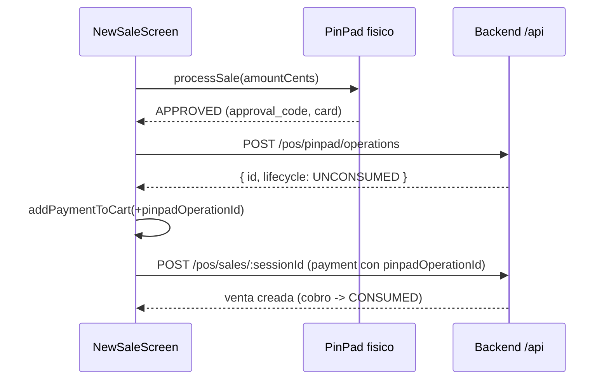

<!--firebender-plan
name: PinPad cobro antes de venta
overview: Implementar en el frontend caja el flujo de cobros PinPad (Izipay) con registro de operacion antes de la venta, consumo del cobro al crear la venta, y compuerta de reconciliacion de cobros huerfanos en el cierre de caja.
todos:
  - id: types
    content: "Agregar tipos PinPad (provider, lifecycle, request/response de operaciones, orphans, void) y extender CreateSaleRequest.payments y SalePayment en src/types/pos.ts"
  - id: paymentflow
    content: "Extender ProcessedSalePayment y buildSalePayments para propagar pinpadOperationId/pinpadProvider; agregar helpers derivePinPadProvider e isPinPadCardMethod en src/utils/paymentFlow.ts"
  - id: service
    content: "Agregar registerPinPadOperation, getOrphanPinPadOperations y voidPinPadOperation en src/services/POSService.ts"
  - id: store
    content: "Ajustar addPaymentToCart para aceptar datos de operacion PinPad y createSale para propagarlos; agregar acciones de orphans/void en el store"
  - id: newsale
    content: "En NewSaleScreen, tras aprobacion del PinPad registrar la operacion y agregar el pago con pinpadOperationId; manejar fallos de registro"
  - id: close-gate
    content: "Crear PinPadOrphansModal e integrar la compuerta de reconciliacion en CashCollectionScreen antes del cierre (y manejo defensivo del 400)"
-->

## Contexto y hallazgos

Hay **dos conceptos distintos de "PinPad"** en el codigo:
- `PinPadService` (`src/services/PinPadService.ts`): habla con el **gateway fisico Verifone** (`localhost:9090`). Ya existe y no cambia su rol.
- Endpoints nuevos del backend `/pos/pinpad/operations` (registro/orphans/void): **no existen aun en el frontend**. Hoy, cuando el PinPad aprueba (`response_code === '00'`), `NewSaleScreen.tsx` solo llama `addPaymentToCart` sin registrar nada en el backend.

Flujo actual de venta: `NewSaleScreen` -> `addPaymentToCart` (store `pos.ts`) -> `createSale` -> `buildSalePayments` (`paymentFlow.ts`) -> `POSService.createSale` (POST `/pos/sales/:sessionId`). El `cashRegisterSessionId` es `currentSession.id`.

Cierre de caja: no usa `/pos/sessions/close` directo; pasa por `CashCollectionScreen` (`mode: 'closure'`) -> `handleRequestCollection` -> `createCollectionRequest`. Ahi va la compuerta.

**Openpay:** se deja para despues. Derivaremos `provider` del codigo del metodo (`OPENPAY_*` -> `OPENPAY`, si no `IZIPAY`), pero el cableado del gateway fisico para Openpay queda pendiente; por ahora solo Izipay usa el gateway.

## Regla de deteccion (clave)

El flujo PinPad (registro de cobro + `pinpadOperationId`) **solo se activa si se detecta un POS Izipay/Openpay conectado**. Si no hay conexion con el terminal, se usa el **flujo normal/manual** (pago con `referenceNumber`, sin `pinpadOperationId`), tal como funciona hoy.

Esto ya existe parcialmente: `NewSaleScreen` calcula `usePinPadFlow = isPinPadCardMethod && isPinPadAvailable`, donde `isPinPadAvailable` proviene de la sonda silenciosa `probeAvailability()` (login + `/test` al gateway, corriendo al montar y cada 30s). Mantendremos esa condicion como unico interruptor:
- **`isPinPadAvailable === true`** (POS Izipay/Openpay detectado): flujo nuevo -> registrar operacion en `/pos/pinpad/operations` y enviar `pinpadOperationId` en la venta.
- **`isPinPadAvailable === false`** (sin POS): flujo clasico manual, sin llamar a `/pos/pinpad/operations` ni enviar `pinpadOperationId`. Nada cambia respecto a hoy.

Consecuencia: los cobros huerfanos y la compuerta de reconciliacion en el cierre solo aparecen cuando efectivamente se uso el terminal; si nunca hubo POS, no hay huerfanos y el cierre no se bloquea.

## Cambios por archivo

### 1. Tipos - [src/types/pos.ts](src/types/pos.ts)
- Agregar `PinPadProvider = 'IZIPAY' | 'OPENPAY'` y `PinPadLifecycle = 'UNCONSUMED' | 'CONSUMED' | 'VOIDED'`.
- Nuevas interfaces: `RegisterPinPadOperationRequest`, `RegisterPinPadOperationResponse` (`{ id, provider, lifecycle }`), `OrphanPinPadOperation`, `OrphanPinPadOperationsResponse` (`{ count, totalCents, operations[] }`), `VoidPinPadOperationResponse` (`{ voided }`).
- Extender `CreateSaleRequest.payments[]` con `pinpadOperationId?: string` y `pinpadProvider?: PinPadProvider`.
- Extender `SalePayment` con `pinpadOperationId?`, `pinpadProvider?` y metadatos de tarjeta para mostrar (`cardLast4?`, `approvalCode?`).

### 2. Utils de pagos - [src/utils/paymentFlow.ts](src/utils/paymentFlow.ts)
- `ProcessedSalePayment`: agregar `pinpadOperationId?` y `pinpadProvider?`.
- `buildSalePayments`: propagar esos campos desde `cartPayments` al request. Para pagos con `pinpadOperationId`, respetar el `amountCents` exacto (debe coincidir con el registrado; no recortar).
- Nuevo helper `derivePinPadProvider(code?: string): PinPadProvider` (`OPENPAY` si el codigo incluye `OPENPAY`, si no `IZIPAY`).
- Generalizar deteccion de "tarjeta PinPad" para incluir `OPENPAY` ademas de `IZIPAY` (helper `isPinPadCardMethod`).

### 3. Servicio API - [src/services/POSService.ts](src/services/POSService.ts)
Tres metodos nuevos usando `this.request`:
- `registerPinPadOperation(body: RegisterPinPadOperationRequest)` -> POST `/pos/pinpad/operations`.
- `getOrphanPinPadOperations(sessionId)` -> GET `/pos/pinpad/operations/orphans/:sessionId`.
- `voidPinPadOperation(provider, id, reason)` -> POST `/pos/pinpad/operations/:provider/:id/void`.
Enviar header opcional `x-device-id` si esta disponible (revisar `DeviceTokenService`/config; si no existe, omitir).

### 4. Store POS - [src/store/pos.ts](src/store/pos.ts)
- `addPaymentToCart(paymentMethodId, amount, extra?)`: aceptar `extra` con `{ pinpadOperationId, pinpadProvider, cardLast4, approvalCode }` y guardarlos en `cartPayments`.
- `createSale`: ajustar el tipo local de `payments` para incluir `pinpadOperationId?`/`pinpadProvider?` (ya vienen de `buildSalePayments`).

### 5. Pantalla de venta - [src/screens/POS/NewSaleScreen.tsx](src/screens/POS/NewSaleScreen.tsx)
Mantener el interruptor `usePinPadFlow = isPinPadCardMethod && isPinPadAvailable` como unica bifurcacion: solo se registra la operacion PinPad cuando el terminal esta detectado. Si `isPinPadAvailable === false`, se cae al flujo manual actual (con `referenceNumber`) sin cambios.

En el bloque `usePinPadFlow` (aprox. lineas 3145-3222), tras `response.response_code === '00'`:
- Derivar `provider` del metodo seleccionado (`derivePinPadProvider`).
- Construir `RegisterPinPadOperationRequest` mapeando la respuesta del gateway: `amountCents` (= `Math.round(amount*100)`), `approvalCode` (`response.approval_code`), `cardMasked` (`response.card`), `cardLast4` (ultimos 4 de `response.card`), `merchantId`, `operationNumber`, `traceNumber`, `rawResponse: response`, `cashRegisterSessionId: currentSession.id`, `status: 'APPROVED'`.
- Llamar `posService.registerPinPadOperation(...)`; con el `id` devuelto, llamar `addPaymentToCart(methodToUse, amount, { pinpadOperationId: id, pinpadProvider: provider, cardLast4, approvalCode })`.
- Si el registro falla, mostrar error y **no** agregar el pago (el cobro quedaria huerfano en el terminal; se resuelve en el cierre). Manejar en `catch`.
- Actualizar deteccion `isIzipayMethod` para usar `isPinPadCardMethod` (incluye Openpay a futuro).
- El flujo sin PinPad (manual, con `referenceNumber`) no cambia.

### 6. Compuerta de reconciliacion en el cierre
- **Store**: agregar acciones (en `pos.ts` o nuevo slice) `fetchOrphanPinPadOperations(sessionId)` y `voidPinPadOperation(provider, id, reason)` que envuelvan al servicio y expongan estado (`orphans`, `isLoadingOrphans`).
- **Componente nuevo** `src/components/pinpad/PinPadOrphansModal.tsx`: lista los cobros huerfanos (monto, `cardLast4`, `approvalCode`, fecha) con boton "Anular con motivo" por item (pide `reason`, llama `voidPinPadOperation`), y refresca la lista. Bloquea el cierre mientras `count > 0`.
- **[src/screens/POS/CashCollectionScreen.tsx](src/screens/POS/CashCollectionScreen.tsx)**: en `handleRequestCollection` (aprox. lineas 410-450), cuando `isClosureMode`, antes de `createCollectionRequest` llamar `fetchOrphanPinPadOperations(currentSession.id)`; si `count > 0`, abrir `PinPadOrphansModal` y abortar el auto-start del cierre hasta resolver. Ademas, en el `catch`, si el error 400 menciona cobros PinPad, abrir el mismo modal (defensivo).

## Flujo objetivo

## Notas / fuera de alcance
- Cableado del gateway fisico para Openpay: pendiente (se configura luego).
- Flujo offline: el registro de cobro PinPad requiere backend online; si esta offline no se invoca (el flujo offline actual se mantiene).
- No se envia nunca el PAN completo: solo se usa `response.card` (ya enmascarado por el gateway).
